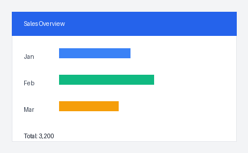

# capability-bridge

> **Love your coding model, but it can't see? Give it eyes.**

Keep DeepSeek, MiniMax, or any text-only model as your coding brain. capability-bridge adds
vision through MCP — without switching your main model.

*A transport-agnostic model capability bridge. MCP is the first transport; Vision is the first capability.*

## Features

- **Give your text-only coding model vision** — `vision_analyze(image, prompt)` and
  `vision_ocr(image)` hand an image to a vision model and return text to your main model, without
  switching it.
- **Pluggable providers** — one `OpenAICompatProvider` speaks any OpenAI-compatible vision endpoint
  (Qwen, GLM, MiniMax-M3, ...); a native `GeminiProvider` covers Google's protocol. Ordered
  fallback with retry and timeout.
- **Intent-driven visual reasoning** — the `prompt` is a task-scoped Visual Brief. UI critique,
  aesthetic review, error-screenshot reading, and art interpretation are all the same primitive,
  not just captioning.
- **One-shot installer** — `capability-bridge setup` merges into `.mcp.json` without clobbering
  other servers, reports missing API keys by name, and `--test` verifies the first provider live.
- **Transport-agnostic Core** — stateless, no Context Manager; the host owns context and distills a
  brief. Architecture red lines are enforced by tests.

## Quickstart (30 seconds)

```bash
# 1. install the CLI once
uv tool install .
# 2. one-shot setup: config + key check + MCP wiring + trigger, optionally a live provider test
capability-bridge setup --target claude-code --test
# 3. in Claude Code / Codex: send a screenshot and ask "what's wrong here?"
```

`setup` never overwrites an existing `.mcp.json` — it merges only the `capability-bridge` entry.
Missing API keys are reported by name; `--test` makes one real call to verify the first provider.

Running from the source repo during development? Start the server with `uv run capability-bridge`
instead of the installed CLI.

## Example

`docs/sample/sample.png` (a small generated dashboard):



From Claude Code / Codex, ask for the image:

```
image:  docs/sample/sample.png
prompt: What does this mini dashboard show? Answer in one short sentence.
```

Real result (`qwen3.6-flash`, returned to your main model as a `VisionResult`):

```json
{
  "content": "This mini dashboard presents a sales overview comparing performance across January, February, and March with a grand total of 3,200.",
  "structured_data": null,
  "provider": "qwen",
  "model": "qwen3.6-flash",
  "latency_ms": 3845,
  "warnings": []
}
```

## How it works

`vision_analyze(image, prompt?)` and `vision_ocr(image)` hand your image to a vision model
(Qwen-VL, GLM-4.6V, Kimi, Gemini, ...) and return the text to your main model. Providers are
tried in the order in `config.yaml`; if one times out, is rate-limited, or is unavailable, the
next one is tried automatically.

## Configuration

`config.yaml` holds three objective sections: `providers` (endpoint type + api key env var),
`models` (provider/model/capabilities), and `routing` (ordered fallback list per capability).
Only objective facts live here — no subjective model scoring. A broken config (unknown model,
missing key) fails fast at startup with the exact field named.

## Default model

The shipped config defaults to **`qwen3.6-flash`** (DashScope). `qwen3-vl-flash` is retired by
DashScope on **2026-10-10**; `qwen3.6-flash` is its official unified text+vision successor (same
OpenAI-compatible interface, just change the model id). The default timeout is 120s because
`qwen3.6-flash` is a reasoning model (complex UI runs take ~40s).

To use a different model, change the `model:` line of the vision model entry in `config.yaml`
(e.g. `qwen3.7-plus`, `MiniMax/MiniMax-M3`, `glm-4.6v-flash`) — a documented optional profile.

> Note: the F1–F4 benchmark (`docs/benchmarks/2026-08-13-qwen-vision-ab.md`) was run on the retired
> `qwen3-vl-flash`. `qwen3.6-flash` is its official successor and should be re-validated for the
> same workloads (its complex-UI output was spot-checked on 2026-08-14 and is on par).

## Tested providers

`OpenAICompatProvider` speaks any endpoint that accepts OpenAI-style multimodal
`/chat/completions` with `image_url` content parts.

**Live tested (v0.1):** Qwen (DashScope), GLM (Zhipu native, `glm-4.6v-flash`), MiniMax-M3 (hosted
on DashScope — needs the model activated in the Bailian console).

**Implemented, automated-tested only:** Gemini native (`GeminiProvider`) — its contract is covered
by tests but it is not in the v0.1 live-provider acceptance matrix.

Compatibility with an OpenAI-compatible endpoint depends on that endpoint actually supporting
multimodal `image_url` inputs (e.g. MiniMax's own API is OpenAI-compatible for text but not for
vision).

## Architecture

```
Agent (Claude Code / Codex)
  │ MCP stdio
  ▼
Transport: MCP            <- only place that imports mcp
  ▼
Capability Core           <- transport-agnostic, stateless
  Capabilities -> Routing -> Providers(interface) <- adapters
```

Concrete provider adapters live outside `core/` and implement the `ModelProvider` interface.
The composition root (`bootstrap.py`) wires config → providers → routing → capability.

## Development

```bash
uv run pytest
```

`tests/test_architecture.py` enforces the red lines (core never imports MCP / clients / concrete providers).
