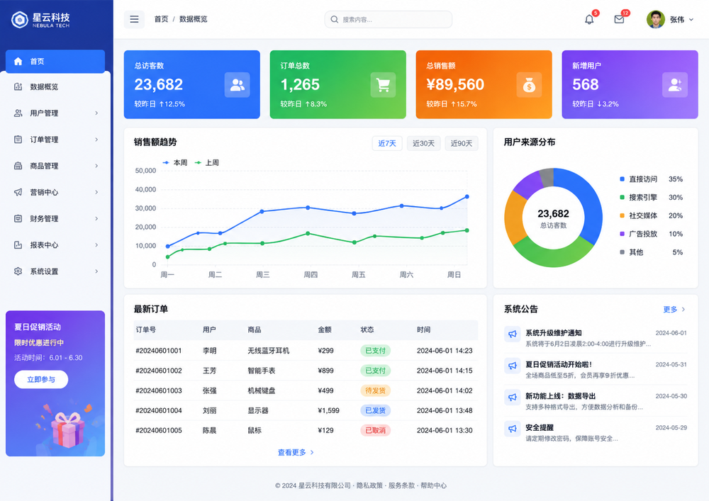

# capability-bridge

> **Love your coding model, but it can't see? Give it eyes.**

Keep DeepSeek, MiniMax, or any coding model — even a text-only one — as your coding brain.
capability-bridge adds vision through MCP, without switching your main model.

*A transport-agnostic model capability bridge. MCP is the first transport; Vision is the first capability.*

## Features

- **Give your text-only coding model vision** — `vision_analyze(image, prompt)` and
  `vision_ocr(image)` hand an image to a vision model and return text to your main model, without
  switching it.
- **Pluggable providers** — one `OpenAICompatProvider` speaks OpenAI-compatible multimodal
  endpoints that accept `image_url` content parts (Qwen, GLM, MiniMax-M3, ...); a native
  `GeminiProvider` covers Google's protocol. Ordered fallback with retry and timeout.
- **Intent-driven visual reasoning** — the `prompt` is a task-scoped Visual Brief. UI critique,
  aesthetic review, error-screenshot reading, and art interpretation are all the same primitive,
  not just captioning.
- **One-shot installer** — `capability-bridge setup` merges into `.mcp.json` without clobbering
  other servers, reports missing API keys by name, and `--test` verifies the first provider live.
- **Transport-agnostic Core** — stateless, no Context Manager; the host owns context and distills a
  brief. Architecture red lines are enforced by tests.

## Quickstart (30 seconds)

> From a cloned repository. (Once published to PyPI, this becomes `uv tool install capability-bridge`.)

```bash
# 1. install the CLI once
uv tool install .
# 2a. Claude Code: one-shot setup (config + key check + MCP wiring + trigger) + live self-test
capability-bridge setup --target claude-code --test
# 2b. Codex: prints the ~/.codex/config.toml snippet and the `codex mcp add` alternative
capability-bridge setup --target codex --test
# 3. send a screenshot and ask "what's wrong here?"
```

`setup` never overwrites an existing `.mcp.json` — it merges only the `capability-bridge` entry.
Missing API keys are reported by name; `--test` makes one real call to verify the first provider.

Running from the source repo during development? Start the server with `uv run capability-bridge`
instead of the installed CLI.

## Examples

`vision_analyze` is visual reasoning, not just image description — the `prompt` is a task-scoped
Visual Brief. One primitive, three levels of use. All results below are real `qwen3.6-flash` output.

### 1. Basic — image understanding


```
image:  docs/sample/sample.png
prompt: What does this mini dashboard show? Answer in one short sentence.
```

```json
{
  "content": "This mini dashboard presents a sales overview comparing performance across January, February, and March with a grand total of 3,200.",
  "structured_data": null,
  "provider": "qwen",
  "model": "qwen3.6-flash",
  "latency_ms": 3845,
  "warnings": []
}
```

### 2. Visual reasoning — UI design critique

Give it a design brief and it becomes a design specialist, not a camera:



```
image:  docs/sample/sample-ui.png
prompt: Analyze this dashboard UI as a senior product designer. This SaaS admin is being visually
        redesigned to look modern, restrained, and professional, reducing the cheap template feel.
        Another coding agent will implement your recommendations. Evaluate: information hierarchy,
        density, whitespace/rhythm, color system, typography, card design, radius/shadows,
        navigation-vs-content, what makes it look templated, and which changes give the most visual
        improvement for the least effort. Do not just describe. Do not write code.
        Output: 1) overall judgment 2) the 5 most important problems 3) a concrete improvement
        direction per problem 4) implementation priority.
```

Real result (abridged):

> The dashboard is currently **shouting**; a premium dashboard should **whisper**. It relies on
> color-based contrast (bright blocks) instead of structural contrast (space, size, weight).
>
> Problems: aggressive rainbow KPI cards (the "chart library" trap) · insufficient whitespace &
> rhythm · visual noise in the charts · weak table hierarchy (2005-Excel borders) · inconsistent
> card styling + a jarring promo banner in the nav.
>
> Priorities: strip the KPI card backgrounds → remove the sidebar promo banner → turn status pills
> into dot+text → open up spacing.

### 3. Aesthetic analysis — artwork interpretation


```
image:  docs/sample/sample-art.png
prompt: Appreciate this artwork as a senior art critic and curator. Analyze: composition and visual
        focus, light and shadow, color relationships and palette, brushwork/texture/material, space
        and depth, style and genre, emotion and atmosphere, aesthetic character and artistic value.
        Be specific and insightful.
```

Real result (abridged):

> A self-referential tableau of digital whimsy and narrative recursion. Strict central composition;
> the open book — not the creature's face — is the true focal point. Warm golden-hour light, no harsh
> chiaroscuro. Monochromatic buttery-yellow harmony, broken only by the lime-green eyes. Shallow
> depth of field isolates a private moment of study. Pop Surrealism × digital character art; the book
> title "How many tears must a calm dragon shed?" turns the image into a dialogue about identity and
> emotion.

## How it works

`vision_analyze(image, prompt?)` and `vision_ocr(image)` hand your image to a vision model
(Qwen, GLM, MiniMax-M3, Gemini, ...) and return the text to your main model. Providers are
tried in the order in `config.yaml`; if one times out, is rate-limited, or is unavailable, the
next one is tried automatically.

## Configuration

`config.yaml` holds three objective sections: `providers` (endpoint type + api key env var),
`models` (provider/model/capabilities), and `routing` (ordered fallback list per capability).
Only objective facts live here — no subjective model scoring. A broken config (unknown model,
missing key) fails fast at startup with the exact field named.

## Default model

The shipped config defaults to **`qwen3.6-flash`** (DashScope). `qwen3-vl-flash` is now a legacy
model family — its legacy snapshots are scheduled for deprecation, and Alibaba recommends
`qwen3.6-flash` as the official recommended replacement for the relevant Qwen3-VL Flash models
(same OpenAI-compatible interface, just change the model id). `qwen3.6-flash` is a hybrid-thinking
model with thinking enabled by default, which adds latency — the default timeout is 120s (complex
UI runs take ~40s).

To use a different model, change the `model:` line of the vision model entry in `config.yaml`
(e.g. `qwen3.7-plus`, `MiniMax/MiniMax-M3`, `glm-4.6v`) — a documented optional profile.

> Note: the F1–F4 benchmark (`docs/benchmarks/2026-08-13-qwen-vision-ab.md`) was run on the now-legacy
> `qwen3-vl-flash`. `qwen3.6-flash` is the official recommended replacement and should be re-validated
> for the same workloads (its complex-UI output was spot-checked on 2026-08-14 and is on par).

## Tested providers

`OpenAICompatProvider` speaks any endpoint that accepts OpenAI-style multimodal
`/chat/completions` with `image_url` content parts.

**Live tested (v0.1):** Qwen (DashScope), GLM (Zhipu native, `glm-4.6v`), MiniMax-M3 (hosted
on DashScope — needs the model activated in the Bailian console).

**Implemented, automated-tested only:** Gemini native (`GeminiProvider`) — its contract is covered
by tests but it is not in the v0.1 live-provider acceptance matrix.

Compatibility with an OpenAI-compatible endpoint depends on that endpoint actually supporting
multimodal `image_url` inputs (e.g. MiniMax's own API is OpenAI-compatible for text but not for
vision).

## Architecture

```
Agent (Claude Code / Codex)
  │ MCP stdio
  ▼
Transport: MCP            <- only place that imports mcp
  ▼
Capability Core           <- transport-agnostic, stateless
  Capabilities -> Routing -> Providers(interface) <- adapters
```

Concrete provider adapters live outside `core/` and implement the `ModelProvider` interface.
The composition root (`bootstrap.py`) wires config → providers → routing → capability.

## Development

```bash
uv run pytest
```

`tests/test_architecture.py` enforces the red lines (core never imports MCP / clients / concrete providers).
